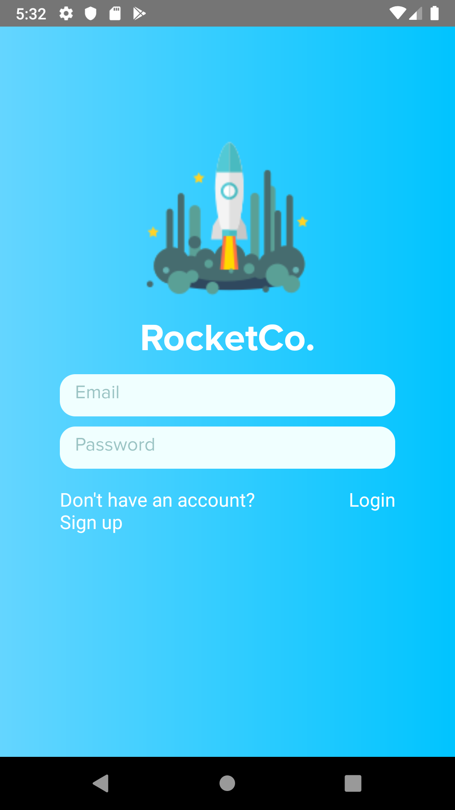
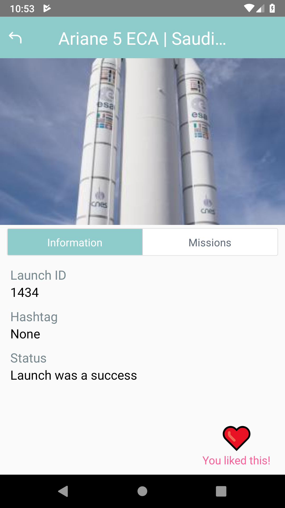
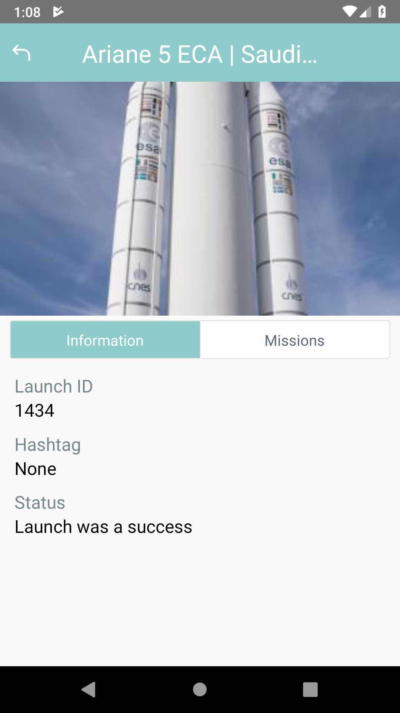
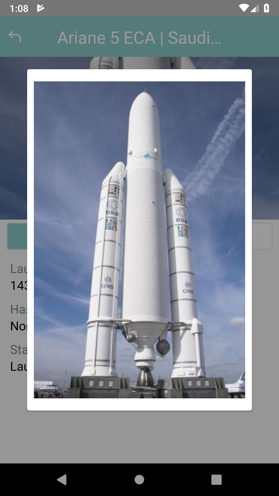
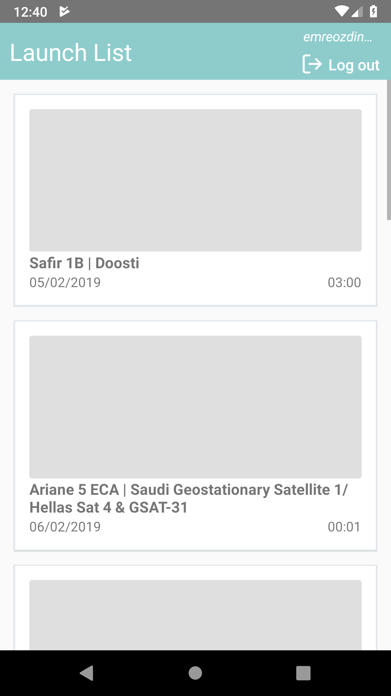
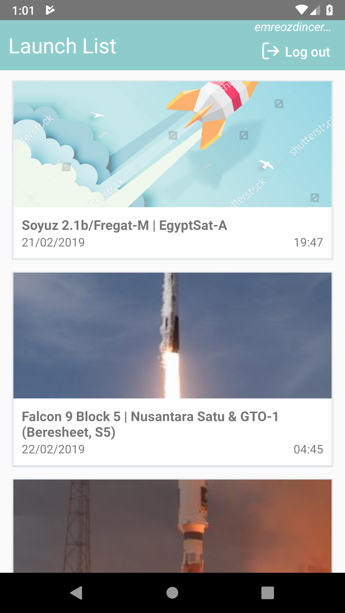

# React-Native Launch App / "RocketCo"

Current Version: [v0.2.0](https://github.com/emreozdincer/launch-app/releases/tag/v0.2.0)

See [CHANGELOG.md](CHANGELOG.md) for change/development history.

## To-Dos  
* Get and show missions
* Implement infinite-scroll logic

## Screenshots

### v0.2.0:

## Screenshots

### v0.1.0:

### v0.0.5:

### v0.0.4:

----

P.S: App is developed only with an Android Emulator.
